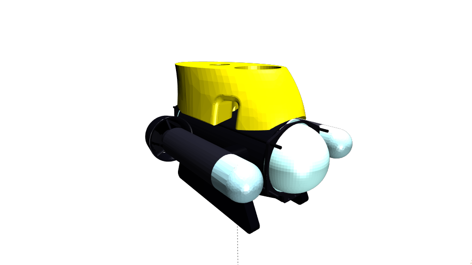

[](https://travis-ci.org/uuvsimulator/desistek_saga)
[](https://github.com/uuvsimulator/desistek_saga/issues)


> Link to the `desistek_saga` repository [here](https://github.com/uuvsimulator/desistek_saga)

> Link to the [documentation page](https://uuvsimulator.github.io/packages/desistek_saga/intro/) 

This repository contains the robot description and necessary launch files to
simulate the [Desistek SAGA ROV vehicle](http://www.desistek.com.tr/).
This repository is complementary to the [Unmanned Underwater Vehicle Simulator (UUV Simulator)](https://github.com/uuvsimulator/uuv_simulator),
an open-source project extending the simulation capabilities of the robotics
simulator Gazebo to underwater vehicles and environments. For installation and
usage instructions, please refer to the [documentation pages](https://uuvsimulator.github.io/).



## Purpose of the project

This software is a research prototype, originally developed for the EU ECSEL
Project 662107 [SWARMs](http://swarms.eu/).

The software is not ready for production use. However, the license conditions of the
applicable Open Source licenses allow you to adapt the software to your needs.
Before using it in a safety relevant setting, make sure that the software
fulfills your requirements and adjust it according to any applicable safety
standards (e.g. ISO 26262).

## Requirements

To simulate the Desistek SAGA ROV vehicle, please refer to the [UUV Simulator](https://github.com/uuvsimulator/uuv_simulator)
repository and follow the installation instructions of the package. Then you can clone
this package in the `src` folder of you catkin workspace

```
cd ~/catkin_ws/src
git clone https://github.com/uuvsimulator/desistek_saga.git
```

and then build your catkin workspace

```bash
cd ~/catkin_ws
catkin_make # or <catkin build>, if you are using catkin_tools
```

## Example of usage

To run a demonstration with the vehicle with teleoperation, you can run a UUV
simulator Gazebo scenario, such as

```bash
roslaunch uuv_gazebo_worlds ocean_waves.launch
```

and then

```bash
roslaunch desistek_saga_gazebo start_demo_teleop.launch joy_id:=0
```

The teleoperation nodes are pre-configured per default for the XBox 360
controller.

## License

SAGA ROV package is open-sourced under the Apache-2.0 license. See the
[LICENSE](https://github.com/uuvsimulator/desistek_saga/blob/master/LICENSE) file for details.
