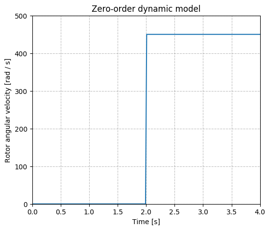
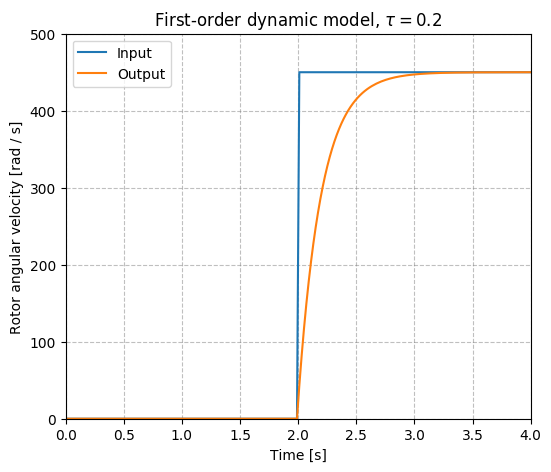
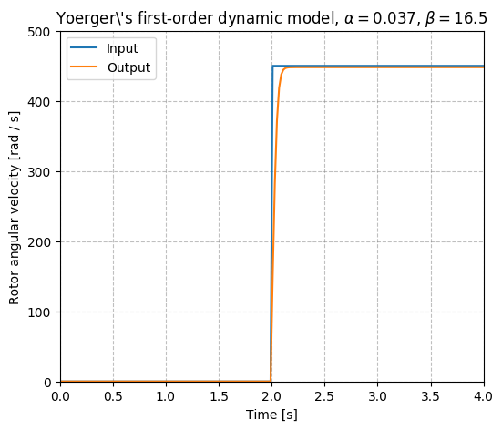
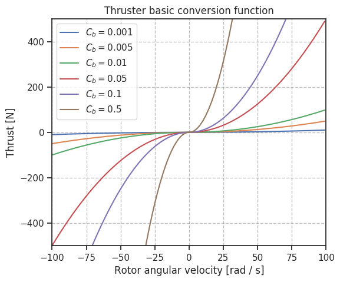
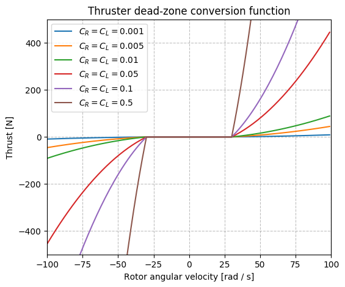

# Thrusters

The thruster units are composed of two modules: the *dynamic model* describing the behavior of the thruster's rotor

## Dynamic models

### `zero_order`



```xml
<dynamics>
  <type>ZeroOrder</type>
</dynamics>
```

### `first_order`



```xml
<dynamics>
  <type>FirstOrder</type>
  <timeConstant>time_constant</timeConstant>
</dynamics>
```

### `yoerger`



```xml
<dynamics>
  <type>Yoerger</type>
  <alpha>alpha</alpha>
  <beta>beta</beta>
</dynamics>
```

> Source

!!! note
    [D. R. Yoerger, J. G. Cooke, and J.-J. E. Slotine, "The influence of thruster dynamics on underwater vehicle behavior and their incorporation into control system design," IEEE Journal of Oceanic Engineering, vol. 15, no. 3, pp. 167-178, Jul. 1990.](http://www.engr.mun.ca/~bachmayer/ENG9095-webpage/thruster/Yoerger1990.pdf)

### `bessa`

```xml
<dynamics>
  <type>Bessa</type>
  <Jmsp>Jmsp</Jmsp>
  <Kv1>Kv1</Kv1>
  <Kv2>Kv2</Kv2>
  <Kt>Kt</Kt>
  <Rm>Rm</Rm>
</dynamics>
```

!!! note
    [Bessa, Wallace Moreira, Max Suell Dutra, and Edwin Kreuzer. "Thruster dynamics compensation for the positioning of underwater robotic vehicles through a fuzzy sliding mode based approach." ABCM Symposium Series in Mechatronics. Vol. 2. 2006.](http://abcm.org.br/symposium-series/SSM_Vol2/Section_IX_Submarine_Robotics/SSM2_IX_01.pdf)

## Conversion functions

### `basic`

> Description

The simple steady-state description of the relationship between rotor's angular velocity and thrust force output is a result of a energy physical analysis presented in `Yoerger et al., 1990`.

$$
  T(\omega) = c_b \omega | \omega |
$$



> URDF description

```xml
<conversion>
    <type>Basic</type>
    <rotorConstant>c_f</rotorConstant>
</conversion>
```

> Source

!!! note
    [D. R. Yoerger, J. G. Cooke, and J.-J. E. Slotine, "The influence of thruster dynamics on underwater vehicle behavior and their incorporation into control system design," IEEE Journal of Oceanic Engineering, vol. 15, no. 3, pp. 167-178, Jul. 1990.](http://www.engr.mun.ca/~bachmayer/ENG9095-webpage/thruster/Yoerger1990.pdf)

### `dead_zone`

> Description

This model sets a dead-zone around $\omega=0$. It was published by
`Bessa, 2006` and requires

$$
T(\omega)=
  \begin{cases}
  C_L (\omega | \omega | - \delta_L), \text{if } \omega | \omega | < \delta_L \\
  C_R (\omega | \omega | - \delta_R), \text{if } \omega | \omega | > \delta_R\\
  0, \text{otherwise}
  \end{cases}
$$



> URDF description

```xml
<conversion>
  <type>Bessa</type>
  <rotorConstantL>rotor_constant_l</rotorConstantL>
  <rotorConstantR>rotor_constant_r</rotorConstantR>
  <deltaL>delta_l</deltaL>
  <deltaR>delta_r</deltaR>
</conversion>
```

> Source

!!! note
    [Bessa, Wallace Moreira, Max Suell Dutra, and Edwin Kreuzer. "Thruster dynamics compensation for the positioning of underwater robotic vehicles through a fuzzy sliding mode based approach." ABCM Symposium Series in Mechatronics. Vol. 2. 2006.](http://abcm.org.br/symposium-series/SSM_Vol2/Section_IX_Submarine_Robotics/SSM2_IX_01.pdf)

### `linear_interp`

> Description

This model is useful in case the specifications of the thrusters in the vehicle are available and the steady-state curve can be retrieved from it.

> URDF description

```xml
<conversion>
  <type>LinearInterp</type>
  <inputValues>0 1 2 3 (replace the input rotor angular velocity values)</inputValues>
  <outputValues>0 1 2 3 (replace the output thrust force output)</outputValues>
</conversion>
```

# Fins