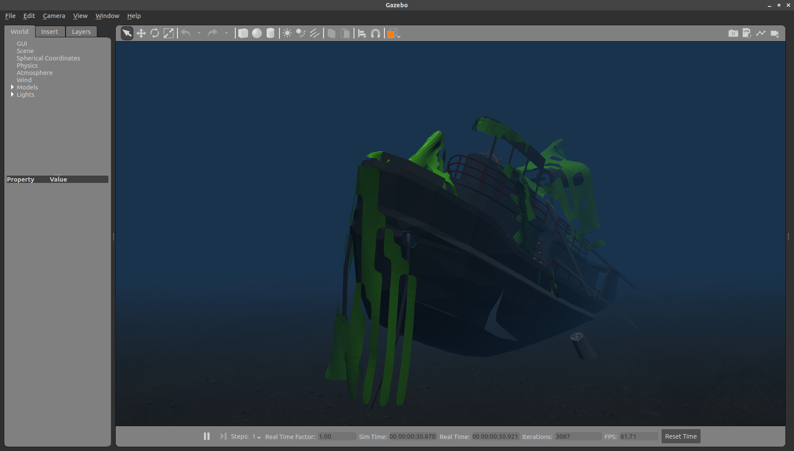
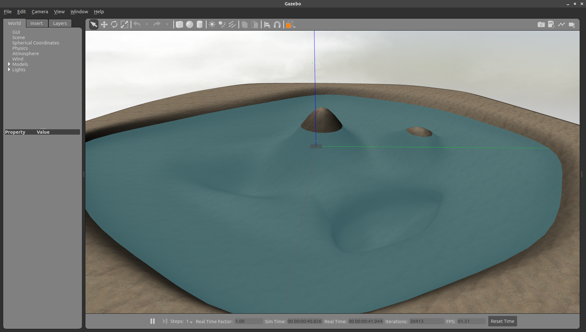
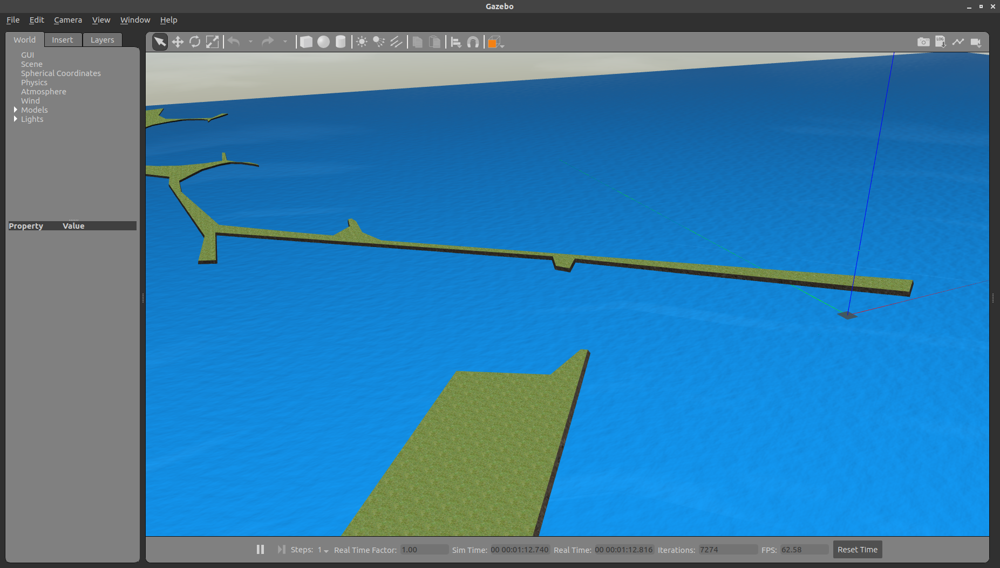
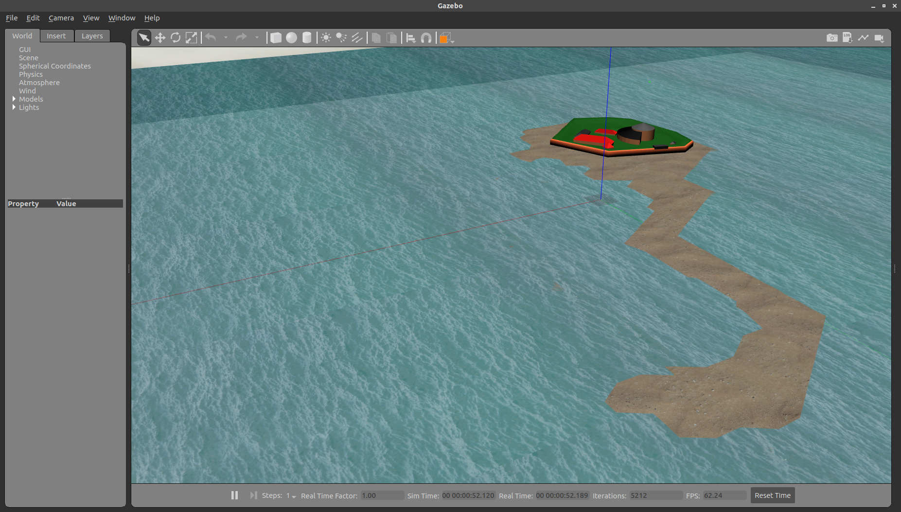
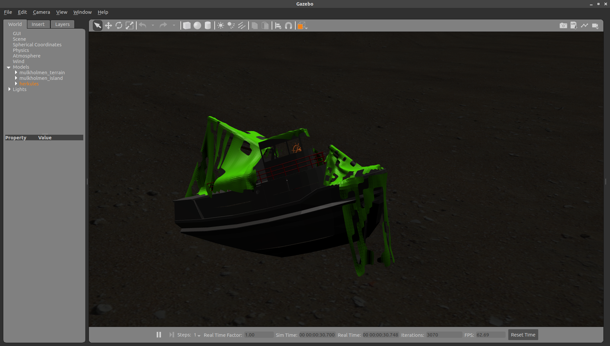
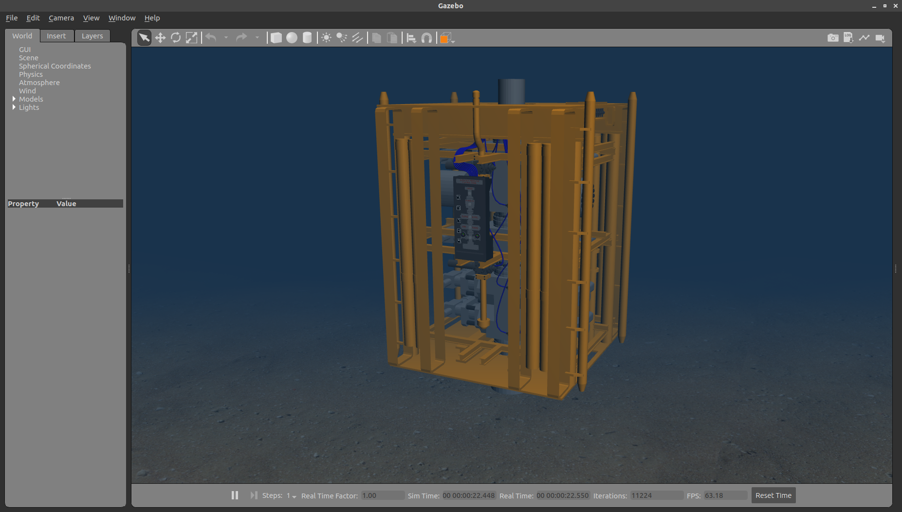

# AUV underwater world

This scenario launches the [`auv_underwater_world.world`](https://github.com/uuvsimulator/uuv_simulator/blob/master/uuv_gazebo_worlds/worlds/auv_underwater_world.world) and is an empty underwater world that can be used to run vehicles that include fins and the [`FinPlugin`](../api/gazebo::FinPlugin.md) from [`uuv_gazebo_plugins`](../packages/uuv_gazebo_plugins.md) or [`FinROSPlugin`](../api/uuv_simulator_ros::FinROSPlugin.md) from [`uuv_gazebo_ros_plugins`](../packages/uuv_gazebo_ros_plugins.md)

To launch Gazebo with this scenario run

```bash
roslaunch uuv_gazebo_worlds auv_underwater_world.launch
```

The ODE physics engine is setup to enable spawning multiple AUVs as shown in the snippet below.

```xml
<physics name="default_physics" default="true" type="ode">
    <max_step_size>0.01</max_step_size>
    <real_time_factor>1</real_time_factor>
    <real_time_update_rate>100</real_time_update_rate>
    <ode>
    <solver>
        <type>quick</type>
        <iters>50</iters>
        <sor>1.2</sor>
    </solver>
    </ode>
</physics>
```

This scenario also starts the [underwater current](../api/uuv_simulator_ros::UnderwaterCurrentROSPlugin.md) to generate 3D current velocity topics as `geometry_msgs/Twist` messages and the [spherical coordinate transform server](../api/gazebo::SubseaPressureROSPlugin.md) to provide services for transformation from ENU or NED to and from spherical coordinates. 

# Empty underwater world

The [`empty_underwater.world`](https://github.com/uuvsimulator/uuv_simulator/blob/master/uuv_gazebo_worlds/worlds/empty_underwater.world) the [underwater current](../api/uuv_simulator_ros::UnderwaterCurrentROSPlugin.md) to generate 3D current velocity topics as `geometry_msgs/Twist` messages and the [spherical coordinate transform server](../api/gazebo::SubseaPressureROSPlugin.md) to provide services for transformation from ENU or NED to and from spherical coordinates. It is an empty underwater space using the `ocean_box` model.

To launch Gazebo with this scenario run

```bash
roslaunch uuv_gazebo_worlds empty_underwater_world.launch
```

# Herkules ship wreck

The Herkules ship wreck scenario contains a Gazebo model reconstruction of the [M\S Herkules](https://www.dykkepedia.com/wiki/Herkules) with a blue fog to emulate the visibility undewater.



To launch Gazebo with this scenario run

```bash
roslaunch uuv_gazebo_worlds herkules_ship_wreck.launch
```

# Lake

Lake with some variations in topography.



To launch Gazebo with this scenario run

```bash
roslaunch uuv_gazebo_worlds lake.launch
```

# Coast of Mangalia, Romania

This scenario was used for the demonstrations of the second demonstration on the [EU-Project SWARMs](http://swarms.eu/) at Mangalia, Romania. 
It contains an approximated model of the seabed around the missions area with the origin set to `(43.797763, 28.598597)`.

<iframe width="425" height="350" frameborder="0" scrolling="no" marginheight="0" marginwidth="0" src="https://www.openstreetmap.org/export/embed.html?bbox=28.566341400146484%2C43.78382917496967%2C28.620114326477054%2C43.81170734524018&amp;layer=mapnik&amp;marker=43.79776988597209%2C28.593227863311768" style="border: 1px solid black"></iframe><br/><small><a href="https://www.openstreetmap.org/?mlat=43.7978&amp;mlon=28.5932#map=15/43.7978/28.5932">View Larger Map</a></small>



To start this scenario, run 

```bash
roslaunch uuv_gazebo_worlds mangalia.launch
```

# Munkholmen, Norway

Located close to the location of the third and final demonstration of the [EU-Project SWARMs](http://swarms.eu/) in Trondheim, Norway, the [Munkholmen islet](https://en.wikipedia.org/wiki/Munkholmen) is modelled here approximate topography of the seabed and the [M\S Herkules ship wreck](https://www.dykkepedia.com/wiki/Herkules).

<iframe width="425" height="350" frameborder="0" scrolling="no" marginheight="0" marginwidth="0" src="https://www.openstreetmap.org/export/embed.html?bbox=10.371029376983644%2C63.44769893169978%2C10.397915840148928%2C63.456330332803205&amp;layer=mapnik&amp;marker=63.4520171%2C10.384477800000013" style="border: 1px solid black"></iframe><br/><small><a href="https://www.openstreetmap.org/?mlat=63.4520&amp;mlon=10.3845#map=16/63.4520/10.3845">View Larger Map</a></small>





To start this scenario, run 

```bash
roslaunch uuv_gazebo_worlds munkholmen.launch
```

!!! warning
    By adding blue fog to this scenario, the fog cannot be limited to only the underwater region. The fog will cover the whole scenario. 

# Ocean waves world

This scenario inclues a sea surface running the [`ocean`](https://github.com/uuvsimulator/uuv_simulator/tree/master/uuv_gazebo_worlds/models/ocean) model `waves shader` to animate the waves during the simulation.

!!! warning
    The waves are only a visual feature. The wave load will not be applied to surface or underwater vehicles.


To start this scenario, run 

```bash
roslaunch uuv_gazebo_worlds ocean_waves.launch
```

# Subsea BOP panel 

The scenario used in the simulated manipulation demonstration for the [EU-Project SWARMs](http://swarms.eu/) in Trondheim, Norway.

<iframe width="640" height="360" src="https://www.youtube.com/embed/vKMR8-7WRF4" frameborder="0" allow="accelerometer; autoplay; encrypted-media; gyroscope; picture-in-picture" allowfullscreen></iframe>

It contains moving valves and April tags used for assistance positioning the manipulator end-effector.



To run this scenario, run

```bash
roslaunch uuv_gazebo_worlds subsea_bop_panel.launch 
```