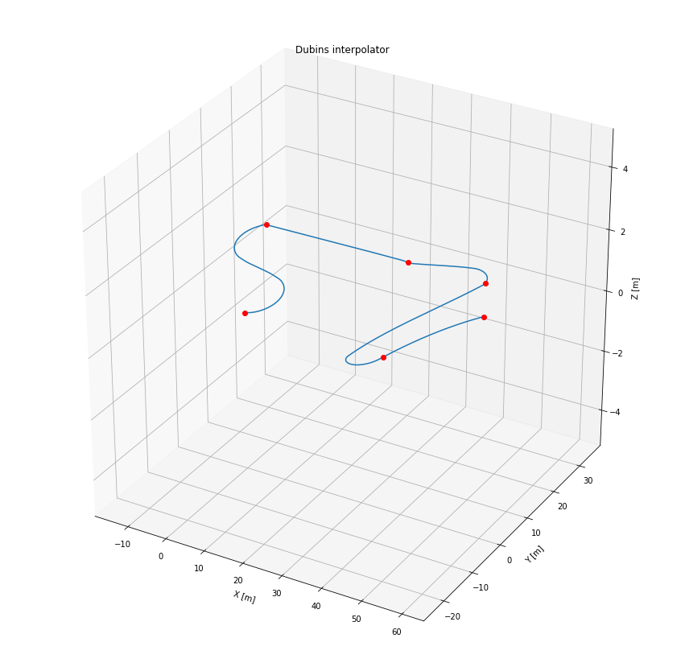

```python
%matplotlib inline

import numpy as np
import matplotlib.pyplot as plt
from mpl_toolkits.mplot3d import Axes3D

from uuv_waypoints import Waypoint, WaypointSet
from uuv_trajectory_generator import DubinsInterpolator
```


```python
q_x = [0, -10, 20, 40, 50, 60]
q_y = [0, 20, 30, 30, -20, 0]
q_z = [0, 1, 0, 0, 2, 2]

q = np.vstack((q_x, q_y, q_z)).T
print(q)
```

    [[  0   0   0]
     [-10  20   1]
     [ 20  30   0]
     [ 40  30   0]
     [ 50 -20   2]
     [ 60   0   2]]


```python
waypoints = WaypointSet()
for i in range(q.shape[0]):
    waypoints.add_waypoint(Waypoint(q[i, 0], q[i, 1], q[i, 2], max_forward_speed=0.5))
```


```python
interpolator = DubinsInterpolator()
interpolator.init_waypoints(waypoints)
interpolator.init_interpolator()
```

     2019-06-20 21:12:58,827 | INFO | path_generator | Setting initial rotation as=[0 0 0 1]


    True


```python
pnts = interpolator.get_samples(max_time=None)

fig = plt.figure(figsize=(15, 15))
ax = fig.add_subplot(111, projection='3d')

ax.plot(
    [p.x for p in pnts],
    [p.y for p in pnts],
    [p.z for p in pnts])
ax.plot(q_x, q_y, q_z, 'ro')

ax.set_zlim([-5, 5])

ax.set_title('Dubins interpolator')
ax.set_xlabel('X [m]')
ax.set_ylabel('Y [m]')
ax.set_zlabel('Z [m]')
```


    Text(0.5, 0, 'Z [m]')




