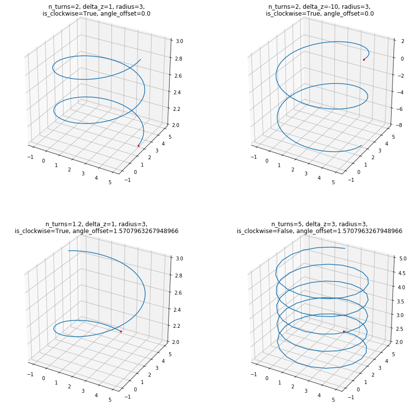

```python
%matplotlib inline

import numpy as np
import matplotlib.pyplot as plt
from mpl_toolkits.mplot3d import Axes3D

from uuv_trajectory_generator import HelicalSegment
```


```python
fig = plt.figure(figsize=(15, 15))
ax = fig.add_subplot(221, projection='3d')

u = np.linspace(0, 1, 100)

radius = 3
center = [2, 2, 2]
n_turns = 2
delta_z = 1
angle_offset = 0.0
is_clockwise = True

helix = HelicalSegment(center, radius, n_turns, delta_z, angle_offset, is_clockwise)

pnts = np.array([helix.interpolate(i) for i in u])
ax.plot(pnts[:, 0], pnts[:, 1], pnts[:, 2])
ax.plot([pnts[0, 0]], [pnts[0, 1]], [pnts[0, 2]], '.r')

ax.set_title('n_turns={}, delta_z={}, radius={},\nis_clockwise={}, angle_offset={}'.format(
    n_turns, delta_z, radius, is_clockwise, angle_offset))
######################################################
ax = fig.add_subplot(222, projection='3d')

radius = 3
center = [2, 2, 2]
n_turns = 2
delta_z = -10
angle_offset = 0.0
is_clockwise = True

helix = HelicalSegment(center, radius, n_turns, delta_z, angle_offset, is_clockwise)

pnts = np.array([helix.interpolate(i) for i in u])
ax.plot(pnts[:, 0], pnts[:, 1], pnts[:, 2])
ax.plot([pnts[0, 0]], [pnts[0, 1]], [pnts[0, 2]], '.r')

ax.set_title('n_turns={}, delta_z={}, radius={},\nis_clockwise={}, angle_offset={}'.format(
    n_turns, delta_z, radius, is_clockwise, angle_offset))
######################################################
ax = fig.add_subplot(223, projection='3d')

radius = 3
center = [2, 2, 2]
n_turns = 1.2
delta_z = 1
angle_offset = 90 * np.pi / 180
is_clockwise = True

helix = HelicalSegment(center, radius, n_turns, delta_z, angle_offset, is_clockwise)

pnts = np.array([helix.interpolate(i) for i in u])
ax.plot(pnts[:, 0], pnts[:, 1], pnts[:, 2])
ax.plot([pnts[0, 0]], [pnts[0, 1]], [pnts[0, 2]], '.r')

ax.set_title('n_turns={}, delta_z={}, radius={},\nis_clockwise={}, angle_offset={}'.format(
    n_turns, delta_z, radius, is_clockwise, angle_offset))
######################################################
ax = fig.add_subplot(224, projection='3d')

radius = 3
center = [2, 2, 2]
n_turns = 5
delta_z = 3
angle_offset = 90 * np.pi / 180
is_clockwise = False

helix = HelicalSegment(center, radius, n_turns, delta_z, angle_offset, is_clockwise)

pnts = np.array([helix.interpolate(i) for i in u])
ax.plot(pnts[:, 0], pnts[:, 1], pnts[:, 2])
ax.plot([pnts[0, 0]], [pnts[0, 1]], [pnts[0, 2]], '.r')

ax.set_title('n_turns={}, delta_z={}, radius={},\nis_clockwise={}, angle_offset={}'.format(
    n_turns, delta_z, radius, is_clockwise, angle_offset))

plt.show()
```




