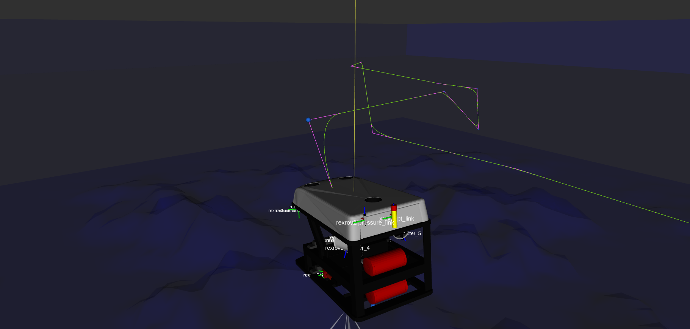

The generation of paths and trajectories in this package are mostly waypoint-based. 
The reference to the controllers are computed by using path interpolators and then
finite differentiation for velocity and acceleration set-points, in case they are
desired.

For the path interpolation to be possible, two Python modules are included in the
[`uuv_trajectory_control` package](../packages/uuv_trajectory_control.md): 
[`uuv_waypoints`](../python_api/uuv_waypoints.md) and [`uuv_trajectory_generator`](../python_api/uuv_trajectory_generator.md).

# Waypoints

# Path generation

## Path segments

The interpolators shown in the next section make use of line or curve segments
that are generated in a way to have a final smooth path (with exception of the
linear interpolator).

All segments are represented by parametric equations in order to allow easy
computation of paths and trajectories for any range of time.

### Line segment

The line segment simply connects two points in space and allows computation
of any points belonging to the line.

### Helical segment

The helical curve segment can be parametrized to generate waypoints that when
interpolated form a helical path.

!!! note

    An example of the use of the `HelicalSegment` class from 
    [`uuv_trajectory_generator` Python module](../python_api/uuv_trajectory_generator.md)
    can be seen in this [Jupyter notebook](jupyter_notebook/helical_paths.md)

> Example

To see a sample of a helical path being followed by a vehicle, you can
start an ROV model with a trajectory tracking controller, such as
the following from the [`rexrov2` package](../../rexrov2/intro.md).

```bash
roslaunch rexrov2_gazebo start_demo_pid_controller.launch
```

To generate a helical path with two turns, run the following

```bash
roslaunch uuv_control_utils start_helical_trajectory.launch uuv_name:=rexrov2 n_turns:=2
```

This example uses the cubic interpolator on the generated waypoints.
The resulting path can be seen as the green line in the image below.


### Bézier curves

[Bézier curves](https://en.wikipedia.org/wiki/B%C3%A9zier_curve) is a type of parametric
curve. The `BezierCurve` class in [`uuv_trajectory_generator` Python module](../python_api/uuv_trajectory_generator.md)
allows the construction of curves of order 3, 4 or 5.

This segment constructor is used by the cubic interpolator, the linear interpolator with
polynomial blends and the final interpolator for the Dubins path generator.

!!! note

    An example of the use of the `BezierCurve` class from 
    [`uuv_trajectory_generator` Python module](../python_api/uuv_trajectory_generator.md)
    can be seen in this [Jupyter notebook](jupyter_notebook/cubic_bezier_curve.md)

## Path interpolators

The path interpolators use a [`uuv_waypoints.WaypointSet`](../python_api/uuv_trajectory_generator.md) 
input to compute the path. Velocities and accelerations can also be computed
by finite differentiation, if necessary.

### Linear interpolator

The linear interpolator simply connects all the waypoints using line segments.

!!! warning

    This path generator may cause undesired jerk movements around the corners.

!!! note

    An example of the use of the `LinearInterpolator` class from 
    [`uuv_trajectory_generator` Python module](../python_api/uuv_trajectory_generator.md)
    can be seen in this [Jupyter notebook](jupyter_notebook/linear_interpolator.md)

To see a sample of a linear interpolator path being followed by a vehicle, 
you can start an ROV model with a trajectory tracking controller, such as
the following from the [`rexrov2` package](../../rexrov2/intro.md).

```bash
roslaunch rexrov2_gazebo start_demo_pid_controller.launch
```

and then use send its controller a set of sample waypoints using the 
`linear` input for the interpolator as follows

```bash
roslaunch uuv_control_utils send_waypoints_file.launch uuv_name:=rexrov2 interpolator:=linear
```


### Cubic interpolator

The cubic interpolator computes a cubic Bézier curve that intersepts all the waypoints in the input set.

The algorithm for this interpolator can be found in `Biagiotti and Melchiorri, 2008`. 

!!! note

    Biagiotti, Luigi, and Claudio Melchiorri. Trajectory planning for automatic machines and robots. Springer Science &Business Media, 2008.

!!! note

    An example of the use of the `CSInterpolator` class from 
    [`uuv_trajectory_generator` Python module](../python_api/uuv_trajectory_generator.md)
    can be seen in this [Jupyter notebook](jupyter_notebook/cubic_interpolator.md)

To see a sample of a cubic interpolator path being followed by a vehicle, 
you can start an ROV model with a trajectory tracking controller, such as
the following from the [`rexrov2` package](../../rexrov2/intro.md).

```bash
roslaunch rexrov2_gazebo start_demo_pid_controller.launch
```

and then use send its controller a set of sample waypoints using the 
`cubic` input for the interpolator as follows

```bash
roslaunch uuv_control_utils send_waypoints_file.launch uuv_name:=rexrov2 interpolator:=cubic
```


### Linear interpolator with polynomial blends

This intepolator is an implementation of the algorithm presented
in `Biagiotti and Melchiorri, 2008` for trajectory generation of manipulators.
It consists basically on line segments generated between
each pair of points on the path and Bezier curve of fifth order
around the corners.

!!! note

    Biagiotti, Luigi, and Claudio Melchiorri. Trajectory planning for automatic machines and robots. Springer Science &Business Media, 2008.

!!! note

    An example of the use of the `LIPBInterpolator` class from 
    [`uuv_trajectory_generator` Python module](../python_api/uuv_trajectory_generator.md)
    can be seen in this [Jupyter notebook](jupyter_notebook/lipb_interpolator.md)

To see an example of this interpolator path being followed by a vehicle, 
you can start an ROV model with a trajectory tracking controller, such as
the following from the [`rexrov2` package](../../rexrov2/intro.md).

```bash
roslaunch rexrov2_gazebo start_demo_pid_controller.launch
```

and then use send its controller a set of sample waypoints using the 
`lipb` input for the interpolator as follows

```bash
roslaunch uuv_control_utils send_waypoints_file.launch uuv_name:=rexrov2 interpolator:=lipb
```




### Dubins interpolator

The Dubins path generator is an expansion of the [2D Dubins path algorithm](https://en.wikipedia.org/wiki/Dubins_path)
that computes the shortest curve between two points. This path
is ideal for vehicles that can only travel forwards, such as AUVs.

Some references for variations the 3D version of the algorithm
are `Owen et al., 2014`, `Cai et al., 2017`, `Hansen et al., 2016` and `Lin et al., 2014`.

As a safety measure, specially for vehicles such as AUVs that 
will maneuver using fins, a configurable maximum pitch angle (set
by default to 5 degrees) is set to control the behaviour of the climbing of the vehilce. In case the necessary pitch angle between
two waypoints exceeds this angle, a helical path is introduced
to avoid the generation of pitch set-points that might make 
the vehicle stall. This will be seen in the example below with the
`rexrov2` vehicle.

!!! note

    Owen, Mark, Randal W. Beard, and Timothy W. McLain. “Implementing Dubins Airplane Paths on Fixed-Wing UAVs*.” Handbook of Unmanned Aerial Vehicles (2014): 1677–1701. 

    Cai, Wenyu, Meiyan Zhang, and Yahong Zheng. “Task Assignment and Path Planning for Multiple Autonomous Underwater Vehicles Using 3D Dubins Curves †.” Sensors 17.7 (2017): 1607. 

    Hansen, Karl D., and Anders La Cour-Harbo. “Waypoint Planning with Dubins Curves Using Genetic Algorithms.” 2016 European Control Conference (ECC) (2016): n. pag. 

    Lin, Yucong, and Srikanth Saripalli. “Path Planning Using 3D Dubins Curve for Unmanned Aerial Vehicles.” 2014 International Conference on Unmanned Aircraft Systems (ICUAS) (2014): n. pag. 

!!! note

    See [here](jupyter_notebooks/2d_dubins_path.md) a Jupyter notebook on the computation of the 2D Dubins path algorithm, including the computation of all the possible curves between two points.

!!! note

    An example of the use of the `DubinsInterpolator` class from 
    [`uuv_trajectory_generator` Python module](../python_api/uuv_trajectory_generator.md)
    can be seen in this [Jupyter notebook](jupyter_notebooks/dubins_interpolator.md)

To see an example of this interpolator path being followed by a vehicle, you can start an ROV model with a trajectory tracking controller, such as the following from the [`rexrov2` package](../../rexrov2/intro.md).

```bash
roslaunch rexrov2_gazebo start_demo_pid_controller.launch
```

and then use send its controller a set of sample waypoints using the 
`dubins` input for the interpolator as follows

```bash
roslaunch uuv_control_utils send_waypoints_file.launch uuv_name:=rexrov2 interpolator:=dubins
```


Below the helical path is generated between the first two
waypoints since the pitch angle exceed the limit. 

