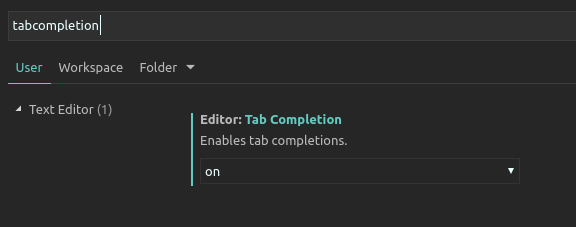

If you use Visual Studio Code, a set of snippets is included in this package.
If you open the `uuv_simulator` project Visual Studio Code or copy the 
[snippets file]() into your snippets folder `~/.config/Code/User/snippets`.

To use the snippets you first have to open Visual Studio Code's settings in
the menu `File->Preferences->Settings` and search for the `editor:tabCompletion`
setting and set it to `on`.



To use it in your code, type the following prefixes and then `tab` to see the options

```
uuv.py.           # For Python snippets
uuv.xml.xacro.    # For Xacro snippets 
uuv.cpp.          # For C++ snippets
```