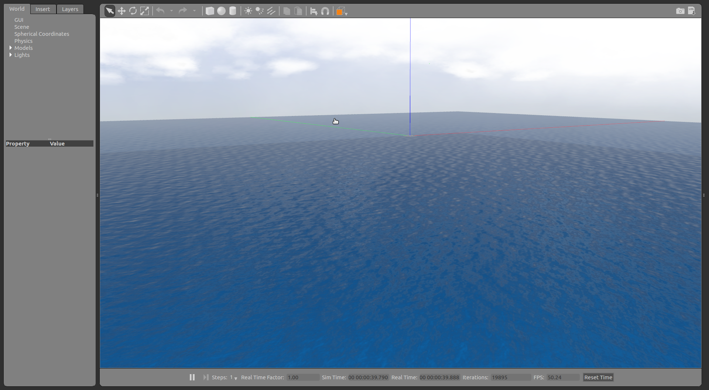
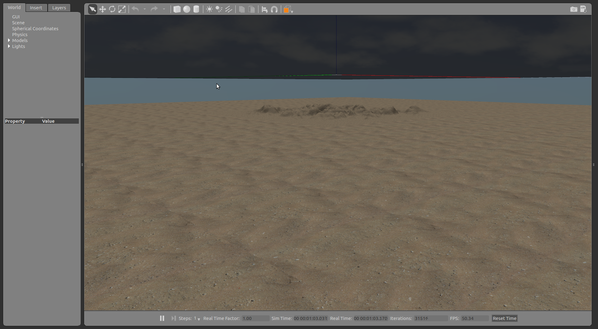
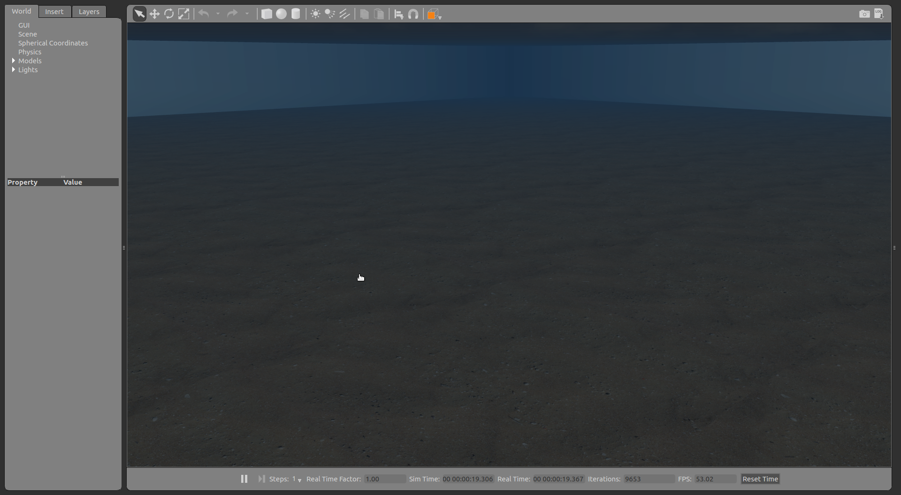
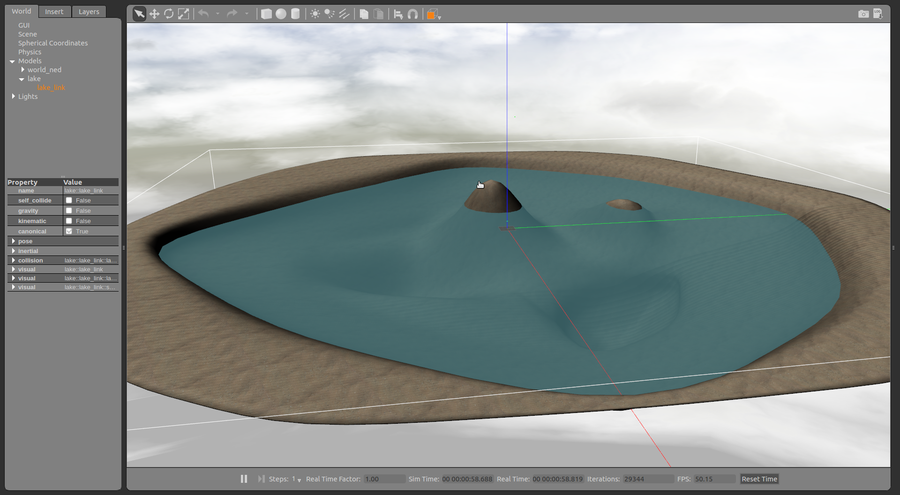
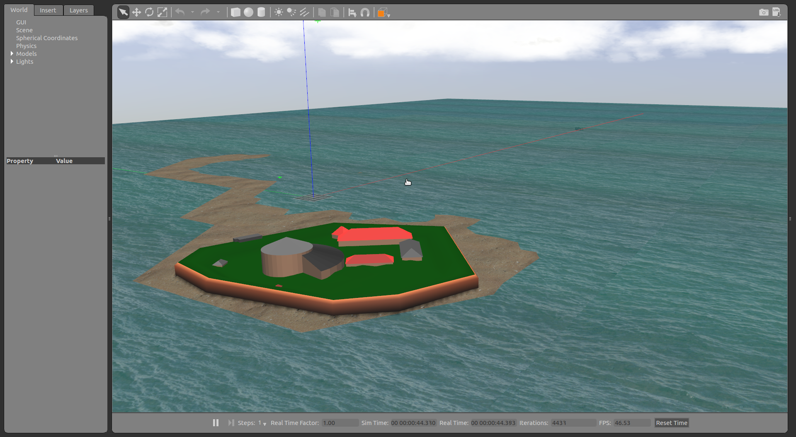

.. _sim_scenarios:

Simulation scenarios 
====================

Ocean waves
-----------

An ocean box with a underwater heightmap and animated waves. To run it, use the following launch file ::

    roslaunch uuv_descriptions ocean_waves.launch

Empty underwater world
----------------------

An ocean box with fog simulation. To run it, use the following launch file ::

    roslaunch uuv_descriptions empty_underwater_world.launch

Simple lake
-----------

A simple lake made with Blender. To run it, use the following launch file ::

    roslaunch uuv_descriptions lake.launch

Mangalia coast, Romania
-----------------------

The location of the second SWARMs project demonstration was modeled in Gazebo with a rough description of the seabed based on depth maps of the region. To run it, use the following launch file ::

    roslaunch uuv_descriptions mangalia.launch

.. image:: ../images/scenarios/mangalia_gazebo.png

.. note::

    The Gazebo model was made based on ../images from the local maps and is a rough approximation of the real topography of the region. 
    Do not use the model as the exact reference for any algorithms.

Location
^^^^^^^^

* **North** 	
    * 43.797763
    * 43° 47' 52.0''
* **East** 	
    * 28.598597
    * 28° 35' 55.0''

.. raw:: html 

    <iframe src="https://www.google.com/maps/embed?pb=!1m18!1m12!1m3!1d11519.30449514271!2d28.589584775845253!3d43.79722090107508!2m3!1f0!2f0!3f0!3m2!1i1024!2i768!4f13.1!3m3!1m2!1s0x0%3A0x0!2zNDPCsDQ3JzUyLjAiTiAyOMKwMzUnNTUuMCJF!5e0!3m2!1spt-BR!2sde!4v1518974604264" width="600" height="450" frameborder="0" style="border:0" allowfullscreen></iframe>

M/S Herkules ship wreck, Trondheim, Norway
------------------------------------------

A approximated model of the M/S Herkules ship wreck located in the Trondheim fjord, in Norway, based on the video below generated as a result from the paper :cite:`Nornes_2015`.

.. raw:: html

    <iframe width="560" height="315" src="https://www.youtube.com/embed/0Po234vEdi0" frameborder="0" allow="autoplay; encrypted-media" allowfullscreen></iframe>

The Gazebo world includes an ocean box with fog simulation and can be started as follows ::

    roslaunch uuv_descriptions herkules_ship_wreck.launch

.. image:: ../images/scenarios/herkules_gazebo.png

.. note::

    This Gazebo model is an 3D approximation made based on ../images and videos generated in :cite:`Nornes_2015`.
    Do not use this model as an exact reference to any algorithms.

Sources
^^^^^^^

* `Dykkepedia <http://www.dykkepedia.com/wiki/Herkules>`_
* `Nornes, Stein M., et al. "Underwater photogrammetric mapping of an intact standing steel wreck with ROV." IFAC-PapersOnLine 48.2 (2015): 206-211. <https://www.sciencedirect.com/science/article/pii/S2405896315002736>`_

Location
^^^^^^^^

* **North** 	
    * 63.453444
    * 63° 27.20664'
    * 63° 27' 12.3984''
* **East** 	
    * 10.405556
    * 10° 24.33336'
    * 10° 24' 20.0016''

.. raw:: html 

    <iframe src="https://www.google.com/maps/embed?pb=!1m18!1m12!1m3!1d7132.388199342336!2d10.403764254406084!3d63.45427718823303!2m3!1f0!2f0!3f0!3m2!1i1024!2i768!4f13.1!3m3!1m2!1s0x0%3A0x0!2zNjPCsDI3JzEyLjQiTiAxMMKwMjQnMjAuMCJF!5e0!3m2!1spt-BR!2sde!4v1518974672363" width="600" height="450" frameborder="0" style="border:0" allowfullscreen></iframe>

Munkholmen islet, Trondheim, Norway
-----------------------------------

.. raw:: html
    
    
 By <a href="//commons.wikimedia.org/wiki/User:Bjoertvedt" title="User:Bjoertvedt">Bjoertvedt</a> - Own work, <a href="https://creativecommons.org/licenses/by-sa/3.0" title="Creative Commons Attribution-Share Alike 3.0">CC BY-SA 3.0</a>, <a href="https://commons.wikimedia.org/w/index.php?curid=26089719">Link</a>

The Munkholmen fortress is located in the Trondheim fjord, in Norway. The Gazebo model includes the islet with the Munkholmen fortress and the M/S Herkules ship wreck. To start the world, run ::

    roslaunch uuv_descriptions munkholmen.launch

.. image:: ../images/scenarios/munkholmen_herkules_gazebo.png

.. note::

    The Gazebo model was made based on ../images from the local maps and is a rough approximation of the real topography of the region. 
    Do not use the model as the exact reference for any algorithms.

Location
^^^^^^^^

* **North** 	
    * 63.4520278
    * 63° 27.1216667'
    * 63° 27' 7.3''
* **East** 	
    * 10.3844722
    * 10° 23.0683333'
    * 10° 23' 4.1''

.. raw:: html

    <iframe src="https://www.google.com/maps/embed?pb=!1m18!1m12!1m3!1d1783.237690876704!2d10.382289116298363!3d63.452019480898436!2m3!1f0!2f0!3f0!3m2!1i1024!2i768!4f13.1!3m3!1m2!1s0x0%3A0x0!2zNjPCsDI3JzA3LjMiTiAxMMKwMjMnMDQuMSJF!5e0!3m2!1spt-BR!2sde!4v1518975706550" width="600" height="450" frameborder="0" style="border:0" allowfullscreen></iframe>

.. raw:: html 

    <iframe src="http://norgeskart.no/#!?project=seeiendom&layers=1002,1015&zoom=14&lat=7044247.28&lon=269983.74&sok=63.4520171,10.3844778&type=1" width="500" height="400" title="Munkholmen Islet, Trondheim, Norway"></iframe>