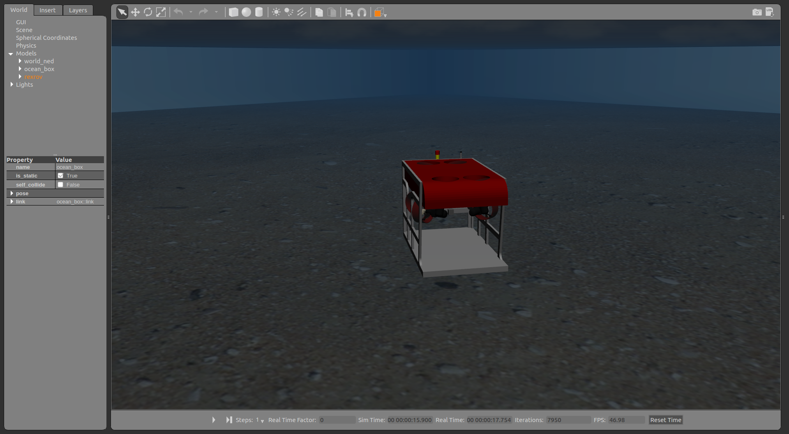

.. _simulation_wrapper:

How to use the wrapper class for repetitive simulation runs
===========================================================

One of the good advantages of simulation implemenations is the possibility of evaluating the complete closed-loop system under several different scenarios that would be difficult to reproduce in real experiments.
That is the case for reinforcement learning and optimization algorithms, to name a few use-cases where the simulation could be used for system evaluation.
Even though that is a promising application of any Gazebo/ROS based simulation, the actual implementation of a wrapper with which the simulation can be started and terminated in a controlled environment involves a lot of attention in order to guarantee that all ROS nodes can be properly started.
For this purposes, a set of nodes and process managers have been implemented as part of the `uuv_simulation_evaluation <https://github.com/uuvsimulator/uuv_simulation_evaluation>`_.
Be sure to install the package in your catkin workspace ::

  cd ~/catkin_ws/src
  git clone https://github.com/uuvsimulator/uuv_simulation_evaluation.git

then build the workspace::

  cd ~/catkin_ws
  catkin build
  source devel/setup.bash

.. note::

  The **uuv_simulation_evaluation** package also requires extra dependencies that can be installed as follows::

    pip3 install smac

Starting and terminating the simulation using a timeout
-------------------------------------------------------

Per default, it is not possible to set a termination time for the simulation.
This is acchieved by a very simple ROS node that is launched by the file below

.. literalinclude:: ../files/tutorials/simulation_wrapper/set_simulation_timer.launch
  :language: xml

and starts the `set_simulation_timer <https://github.com/uuvsimulator/uuv_simulation_evaluation/blob/master/uuv_simulation_wrapper/scripts/set_simulation_timer>`_ Python ROS node.
This node will simply read simulation time from **/clock** and use the **timeout** input argument to count down the simulation time.
Since the node is initialized with the **required** flag, all ROS processes are terminated once the timeout is reached.
The only requirement is that this node has to be called with the rest of the processes running the simulation (including the Gazebo process) to terminate the simulation at a specified timeout, namely start the **set_simulation_timer** node in the launch file.

.. note::

  For more information on the **required** flag, check the `official ROS wiki page <http://wiki.ros.org/roslaunch/XML/node>`_.

One small example is starting the empty underwater world and setting a simulation timeout in a launch file as follows ::

  <launch>
    <include file="$(find uuv_descriptions)/launch/empty_underwater_world.launch">
        <arg name="gui" value="true"/>
        <arg name="paused" value="false"/>
    </include>

    <include file="$(find uuv_simulation_wrapper)/launch/set_simulation_timer.launch">
        <arg name="timeout" value="10"/>
    </include>
  </launch>

This example will lead to the Gazebo simulation being terminated after 10 seconds.
One further problem can appear when starting a large number of ROS nodes that depend on Gazebo's simulation.
Gazebo's process can often take some time to be initialized and some services and topics might not be available right away until all plugins have been set in place.
That can lead to some issues with some ROS nodes that will find that services and topics are unavailable right after starting the simulation.
That is easier to control when starting all nodes manually using the command line, but can be an issue when setting up automated simulation runs.
For this issue, one further ROS node can be used to unpause the Gazebo simulation after a timeout, making it easier to control the startup process.
This can be seen in the following sample launch file ::

  <launch>
    <include file="$(find uuv_descriptions)/launch/empty_underwater_world.launch">
        <arg name="gui" value="true"/>
        <arg name="paused" value="true"/>
    </include>

    <include file="$(find uuv_simulation_wrapper)/launch/set_simulation_timer.launch">
        <arg name="timeout" value="10"/>
    </include>

    <include file="$(find uuv_simulation_wrapper)/launch/unpause_simulation.launch">
        <arg name="timeout" value="5"/>
    </include>
  </launch>

What this example does is unpause the simulation after 5 seconds and helps to control the startup of all nodes that use the simulation time for their cycles.
Is essential in this case to start the Gazebo world with the **paused** flag set to **true**. ::

  <arg name="paused" value="true"/>

This example can be run using the following sample launch file ::

  roslaunch uuv_simulation_timer_example start_timer_example.launch

Using the Python wrapper to run a simulation
--------------------------------------------

In the **uuv_simulation_wrapper** package, a simulation wrapper is implemented as a part of the **uuv_simulation_runner** Python library that can be used to start a simulation and evaluate its resulting ROS bag from a Python application.
Some configuration is needed to acchieve it, but an example is available in the catkin package `uuv_simulation_runner_example <https://github.com/uuvsimulator/uuv_simulation_evaluation/tree/master/uuv_evaluation_examples/uuv_simulation_runner_example>`_.
The folder structure of the this demonstration consists of a catkin package set as ::

  uuv_simulation_runner_example
  |-- config
      |-- task.yml
  |-- launch
      |-- start_simulation.launch
  |-- scripts
      |-- run_grid_search
  `-- CMakeLists.txt
  `-- package.xml

The different elements necessary to make the evaluation using the wrapper are described below.

Simulation launcher
^^^^^^^^^^^^^^^^^^^

The launch file `start_simulation.launch <https://github.com/uuvsimulator/uuv_simulation_evaluation/blob/master/uuv_evaluation_examples/uuv_simulation_runner_example/launch/start_simulation.launch>`_ must contain all the nodes and elements to start the simulation that needs to be evaluated.
In this example the Gazebo world starts with the simulation timers presented in the previous section, a RexROV vehicle is spawned with a PID controller node.
A helical trajectory then is initialized and a constant current is applied to the scenario.
Some of the elements of the launch file that will be common to other use-cases are described below.

**Recording the results**

The evaluation of the simulation is achieved by analyzing the resulting ROS bag.
The simulation wrapper expects the launch file to have an input string **bag_filename** to set, and it can be defined in the launch file as follows ::

  <arg name="record" default="false"/>
  <arg name="bag_filename" default="recording.bag"/>

In the launch file there must be also an **rosbag recording** node being started having the vehicle's states and other topics as an input as in the example below ::

  <node pkg="rosbag" type="record" name="recording"
      args="record -O $(arg bag_filename)
      /rexrov/dp_controller/trajectory
      /rexrov/dp_controller/reference
      /rexrov/pose_gt_ned
      /hydrodynamics/current_velocity
      /rexrov/thruster_manager/input
      /rexrov/wrench_perturbation
      /rexrov/thrusters/0/thrust
      /rexrov/thrusters/1/thrust
      /rexrov/thrusters/2/thrust
      /rexrov/thrusters/3/thrust
      /rexrov/thrusters/4/thrust
      /rexrov/thrusters/5/thrust
      /rexrov/thrusters/6/thrust
      /rexrov/thrusters/7/thrust"
      if="$(arg record)"/>

The **record** flag is optional but useful while testing the launch file before running the simulation with the wrapper to avoid recording ROS bag unnecessarely.

.. note::

  The pose of the vehicle can be recorded with respect to Gazebo's default inertial frame **world** (that uses the East-North-Up convention) by using the **/<vehicle>/pose_gt** topic or with respect to the generated **world_ned** frame (that uses the North-East-Down convention) by using **/<vehicle>/pose_gt_ned**.

  For this the vehicle must use the sensor plugins included in **uuv_sensor_ros_plugins** package and the static TF frame **world_ned** must exist (which is already done when starting one of the Gazebo worlds included in the UUV simulator package).

  Check this `Wikipedia page <https://en.wikipedia.org/wiki/Axes_conventions>`_ for more information on both conventions.

.. note::

  The topic **/rexrov/wrench_perturbation** is generated when using the disturbance manager node described in :ref:`disturbances`.

**Turning off the frontend during the evaluation**

To avoid unnecessary overhead when doing repetitive evaluations of the same scenario, a flag can be given as an input of to turn off the Gazebo client and other visualization tools as RViz.
In the example the flag is given as ::

  <arg name="gui" default="true"/>

and is used as ::

  <include file="$(find uuv_descriptions)/launch/empty_underwater_world.launch">
      <arg name="gui" value="$(arg gui)"/>
      <arg name="paused" value="true"/>
  </include>

  <node name="rviz" pkg="rviz" type="rviz" output="screen"
      args="-d $(find uuv_gazebo)/rviz/controller_demo.rviz"
      if="$(arg gui)"/>

Having the flag as an input is useful when running the launch file without the evaluation to check the scenario, namely ::

  roslaunch uuv_simulation_runner_example start_simulation.launch gui:=true record:=false

**Having the variables to be varied in the different evaluations as an input**

For the simulation wrapper to provide different variables that can influence the simulation, these variables have to be configured as input arguments on the launch file.
In this example presented here, the vehicle will be set to follow a helical trajectory under constant currents of different magnitudes.
The ROS node that generates the constant current is the following ::

  <include file="$(find uuv_control_utils)/launch/set_timed_current_perturbation.launch">
    <arg name="starting_time" value="0.0"/>
    <arg name="end_time" value="-1"/>
    <arg name="current_vel" value="$(arg current_vel)"/>
    <arg name="horizontal_angle" value="$(arg horizontal_angle)"/>
  </include>

and to change the magnitude of the current, the **current_vel** must be one input argument of the launch file, namely ::

  <arg name="current_vel" default="0.0"/>

The default value is set to zero, but the simulation wrapper is then capable of calling the launch file in a separate process giving **current_vel** as an input.

**Simulation timers**

As explained before, it is crucial to include the **simulation timer** and **unpause simulation** nodes so that every simulation run to have the same time span. ::

  <include file="$(find uuv_simulation_wrapper)/launch/set_simulation_timer.launch">
      <arg name="timeout" value="$(arg timeout)"/>
  </include>

  <include file="$(find uuv_assistants)/launch/unpause_simulation.launch">
      <arg name="timeout" value="$(arg unpause_timeout)"/>
  </include>

The Gazebo world has to be also initialized using the **paused** flag as well to the unpause simulation node to work. ::

  <include file="$(find uuv_descriptions)/launch/empty_underwater_world.launch">
      <arg name="gui" value="$(arg gui)"/>
      <arg name="paused" value="true"/>
  </include>

**Testing the simulation**

By running the launch file as ::

  roslaunch uuv_simulation_runner_example start_simulation.launch gui:=true record:=false

Both the RViz and Gazebo screens should appear as shown below.

.. image:: ../images/tutorial_simulation_runner/sim_rviz.png

Simulation wrapper task file
^^^^^^^^^^^^^^^^^^^^^^^^^^^^

The **task.yml** file contains a set of parameters necessary for the simulation wrapper to run the simulation in a separate process.

.. literalinclude:: ../files/tutorials/simulation_wrapper/task.yml

The parameters fields are described below:

* **cmd:** Command to call the launch file.
* **params:** List of parameter to be overriden during the evaluations. Setting the **gui** to false and **record** to true are some examples.
* **id:** An ID for the evaluation being performed.

Simulation runner script
^^^^^^^^^^^^^^^^^^^^^^^^

The code that uses the simulation wrapper can be seen below, with a step-by-step explanation of its functionalities in the comments.
In this example, the **Evaluation** class is used to read the ROS bag and generate performance indicators, along with plots, but any script can be used for that purpose.

.. literalinclude:: ../files/tutorials/simulation_wrapper/run_grid_search
  :language: python

Running the example
-------------------

As shown in this line of the script shown in the last section shows ::

  DEFAULT_RESULTS = os.path.join(ROOT_PATH, 'results')

the **results** folder will be created in the **uuv_simulation_runner_example** folder.
The results folder in this case will have one folder for each simulation run containing ROS bag, plots and log files for the each simulation scenario run with a different current velocity magnitude.
To run the example, use the following command ::

  rosrun uuv_simulation_runner_example run_grid_search --n_points <N_POINTS>

.. note::

  The Python simulation wrapper assigns a random port to the ROS master and Gazebo for each time a new simulation run is done and locks the ports for the duration of the simulation.
  That allows several instances of the simulation to be started at the same time using this wrapper.
